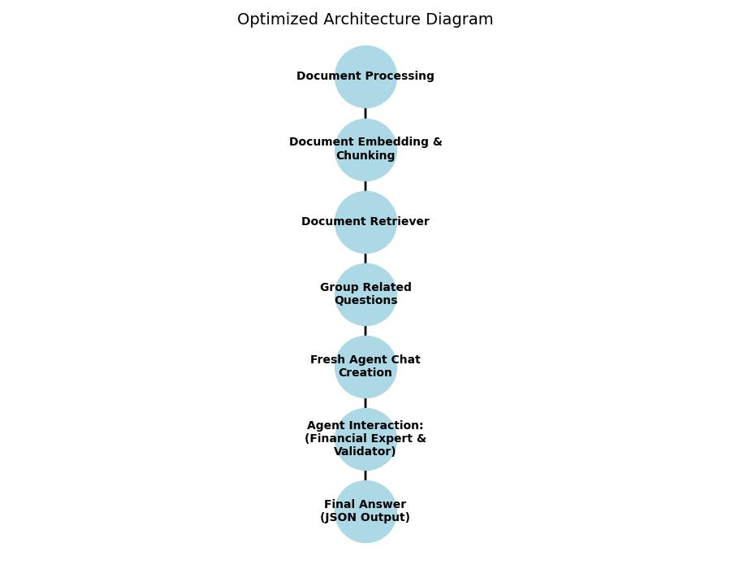

# Optimized Document Analysis and Q&A System

This document outlines the improvements made to the original Document Analysis and Q&A System to reduce Tokens Per Minute (TPM) usage while maintaining the accuracy of responses. The optimizations focus on efficient token usage, streamlined agent interactions, and enhanced context sharing.

## Key Improvements

### 1. Optimized Token Usage
- **Controlled Document Chunking:**
  - Document chunks are truncated to a maximum defined size (e.g., 1500 characters) with limits on the number of chunks processed per call.
  - This approach reduces the amount of token consumption per API call.
- **Efficient Embedding Operations:**
  - By restricting the number of documents processed (e.g., to a maximum of 10) and reducing per-document chunks, redundant embedding calls are minimized.

### 2. Streamlined Agent Interactions
- **Fresh Chat Instances Per Question:**
  - Instead of attempting to reset existing agent chats (which can lead to state issues), a fresh chat instance is created for each question or question group.
  - This approach avoids errors such as "Unable to proceed while another agent is active" and ensures a clean state with each interaction.
- **Limited Iterations:**
  - The number of conversation iterations is limited (e.g., to 3) to further reduce token usage.
- **Simplified and Concise Prompts:**
  - Prompts for the agents have been shortened and made more direct to minimize unnecessary token consumption.

### 3. Enhanced Context Sharing
- **Grouped Questions:**
  - Related questions are grouped using a dedicated mechanism (via the `group_related_questions` function) which allows sharing of context and relevant document chunks.
  - This reduces redundant processing since similar questions reuse document retrieval results.
- **Minimized Reset Overhead:**
  - Instead of resetting chats repeatedly, new agent chats are instantiated per question group, leading to cleaner and more reliable state management.

## Updated Architecture

The updated architecture diagram is shown below:



The updated architecture focuses on efficient token usage, streamlined agent interactions, and embedding-based document processing. Key elements include:

1. **Document Embedding Process:**
   - Documents are chunked with strict limits on size and number.
   - Embeddings are generated once and reused for related questions, reducing redundant operations.

2. **Dynamic Agent Chat Creation:**
   - A fresh agent chat (`AgentGroupChat`) is created for each question or group of related questions instead of attempting internal resets.
   - This design choice simplifies state handling and avoids errors during chat resets.

3. **Shared Context for Related Questions:**
   - Grouping related questions ensures that context and document chunks are effectively reused, minimizing the need for repeated token-intensive operations.

## Benefits of the Optimized System
- **Reduced Operational Costs:**
  - Lower token usage translates to lower costs.
- **Improved Efficiency:**
  - Quick response times are achieved by limiting iterations and ensuring each agent operates within a clean state.
- **Enhanced Reliability:**
  - Fresh chat instantiation avoids reset-related errors and state conflicts.
- **Maintained Accuracy:**
  - Despite the token and iteration limitations, careful grouping and context sharing ensure accurate responses.

## Limitations
- The system is fine-tuned for handling financial documents; additional optimizations may be necessary for other document types.
- Specific document layouts could require further adjustments to the chunking strategy.

## How to Use the Optimized System

### Prerequisites
- Azure Document Intelligence service
- Azure OpenAI service

### Environment Configuration
1. Create a `.env` file with your Azure service credentials and embedding model configuration:

```
DOCUMENTINTELLIGENCE_ENDPOINT=your_document_intelligence_endpoint
DOCUMENTINTELLIGENCE_API_KEY=your_document_intelligence_key
AZURE_OPENAI_ENDPOINT=your_azure_openai_endpoint
AZURE_OPENAI_API_KEY=your_azure_openai_key
AZURE_OPENAI_CHAT_DEPLOYMENT_NAME=your_deployment_name
AZURE_OPENAI_API_VERSION=2023-05-15
EMBEDDING_MODEL=text-embedding-ada-002
```

2. Install dependencies:

```bash
pip install -r requirements.txt
```

### Processing Documents
To process a collection of documents and generate embeddings:

```python
from document_processing import process_folder
from generate_embeddings import create_document_embeddings

# Step 1: Process all PDFs in the specified folder and save results to processed_documents/
process_folder("anonymized_examples")

# Step 2: Generate embeddings for the processed documents
create_document_embeddings("processed_documents/document_index.json")
```

### Schema-Based Q&A
The system uses JSON schema files to define questions and answer formats. Here's an example schema:

```json
{
  "assetsAndIncome": {
    "properties": {
      "totalBankableAssets": {
        "displayName": "Total Bankable Assets",
        "description": "What is the total value of bankable assets for $_var_individual?",
        "example": "CHF 1'500'000.00"
      },
      "totalRealEstateValue": {
        "displayName": "Real Estate Value",
        "description": "What is the total value of real estate owned by $_var_individual?",
        "example": "CHF 2'500'000.00"
      }
    }
  }
}
```

## Summary
The optimized system implements controlled document chunking, fresh agent chat instantiation, and grouped question processing to reduce TPM usage while maintaining high-quality and accurate responses. This results in faster, more reliable performance and reduced operational costs.
