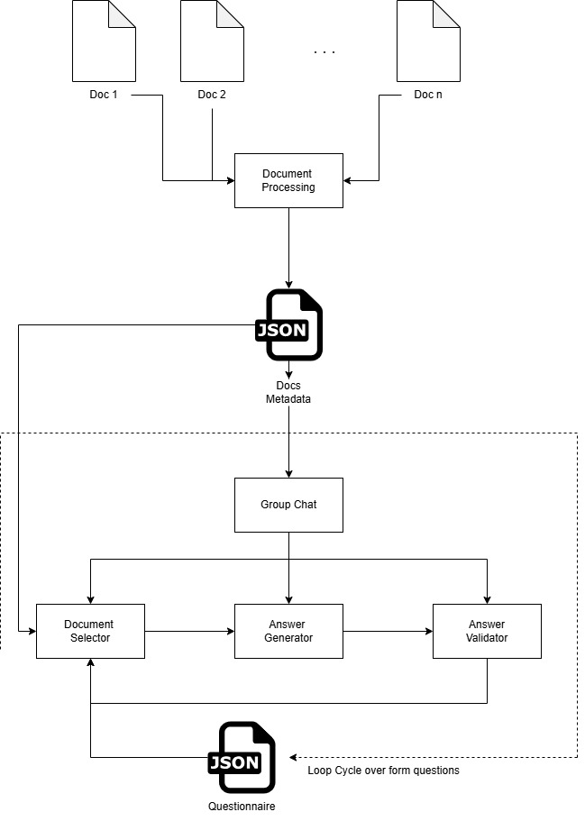

# Document Analysis and Q&A System

This repository contains a proof-of-concept application that demonstrates how to use Azure AI services to process, analyze, and extract insights from document collections. The system combines Azure Document Intelligence for document parsing with Azure OpenAI for metadata generation and question answering.

## Overview

The application performs these key functions:

1. **Document Processing:** Convert PDF documents to markdown format using Azure Document Intelligence
2. **Metadata Generation:** Extract key insights, entities, and categorize documents using Azure OpenAI
3. **Document Indexing:** Create a searchable index of all processed documents
4. **Interactive Q&A:** Answer complex questions about the documents using a multi-agent system

## Architecture

The system consists of several components:



- **Document Processing:** Converts PDFs to markdown with metadata
- **Docs Metadata:** Maintains a search-friendly catalog of all processed documents
- **Group Chat:** Orchestrates multi-agent conversations to answer questions
  - Document Retriever Agent: Selects relevant documents
  - Answer Generator Agent: Creates answers from document content
  - Answer Validator Agent: Ensures accuracy and formatting

## Setup

### Prerequisites

- Azure Document Intelligence service
- Azure OpenAI service

### Environment Configuration

1. Create a `.env` file with your Azure service credentials:

```
DOCUMENTINTELLIGENCE_ENDPOINT=your_document_intelligence_endpoint
DOCUMENTINTELLIGENCE_API_KEY=your_document_intelligence_key
AZURE_OPENAI_ENDPOINT=your_azure_openai_endpoint
AZURE_OPENAI_API_KEY=your_azure_openai_key
AZURE_OPENAI_CHAT_DEPLOYMENT_NAME=your_deployment_name
AZURE_OPENAI_API_VERSION=2023-05-15
```

2. Install dependencies:

```bash
pip install -r requirements.txt
```

## Usage

### Processing Documents

To process a collection of documents:

```python
from document_processing import process_folder

# Process all PDFs in the specified folder and save results to processed_documents/
process_folder("anonymized_examples")
```

## Schema-Based Q&A

The system uses JSON schema files to define questions and answer formats. Here's an example schema:

```json
{
  "assetsAndIncome": {
    "properties": {
      "totalBankableAssets": {
        "displayName": "Total Bankable Assets",
        "description": "What is the total value of bankable assets for $_var_individual?",
        "example": "CHF 1'500'000.00"
      },
      "totalRealEstateValue": {
        "displayName": "Real Estate Value",
        "description": "What is the total value of real estate owned by $_var_individual?",
        "example": "CHF 2'500'000.00"
      }
    }
  }
}
```

## Key Features

- **Intelligent Document Processing:** Convert complex PDFs to searchable markdown
- **Metadata Enrichment:** Automatically generate descriptive metadata
- **Multi-Agent Q&A:** Use specialized agents for different parts of the question answering process
- **Source Citations:** Track which documents provided each answer
- **Template-Based Answers:** Ensure consistent formatting in responses

## Limitations

- Currently optimized for financial documents
- Limited support for complex layouts
